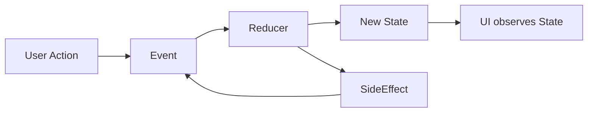

# Android-MVI-Sample
> `Reducer` 기반의 MVI 패턴을 적용한 Android 샘플 프로젝트입니다.

구글의 권장 아키텍처를 기반으로 설계되었으며, GitHub API를 통해 사용자를 검색하고 상세 정보를 조회할 수 있습니다.

✅ English description is provided below

## 한국어
### 📌 Description
이 프로젝트는 **MVI(Model-View-Intent)** 패턴을 기반으로 한 안드로이드 앱 샘플입니다.  
**피드백은 언제든 환영**입니다.

> 📘 참고: 용어는 `Intent` 대신 `Event`라고 칭했습니다.

기본적으로 **단방향 데이터 흐름(Unidirectional Data Flow)** 을 유지하며,  
아래와 같은 흐름을 따라 새로운 상태를 생성하는 `Reducer`를 중심으로 아키텍처를 설계했습니다:


### 🔁 Concept


### 📦 Reducer
```kotlin
abstract class Reducer<State : Reducer.State, Event : Reducer.Event, SideEffect : Reducer.SideEffect> {
    interface State
    interface Event
    interface SideEffect

    abstract fun reduce(currentState: State, event: Event): ReducerResult<State, SideEffect>

    data class ReducerResult<State : Reducer.State, SideEffect : Reducer.SideEffect>(val newState: State, val sideEffects: List<SideEffect>)
    
    protected fun <State : Reducer.State> reducerResult(
        newState: State,
    ): ReducerResult<State, SideEffect> = ReducerResult(newState, emptyList())

    protected fun <State : Reducer.State, SideEffect : Reducer.SideEffect> reducerResult(
        newState: State,
        sideEffects: SideEffect
    ): ReducerResult<State, SideEffect> = ReducerResult(newState, listOf(sideEffects))

    protected fun <State : Reducer.State, SideEffect : Reducer.SideEffect> reducerResult(
        newState: State,
        sideEffects: List<SideEffect>
    ): ReducerResult<State, SideEffect> = ReducerResult(newState, sideEffects)
}
```
| 구성요소   | 설명 |
|------------|------|
| **Reducer** | `Event`를 처리하여 새로운 `State`를 생성 |
| **ReducerResult** | `Reducer`의 결과로, 새로운 상태(State)와 하나 이상의 사이드이펙트(SideEffect)를 함께 담고 있는 데이터 구조 |
| **Event** | 사용자의 액션 또는 시스템 트리거. `Reducer.Event`로 정의 |
| **SideEffect** | 네트워크 요청, Toast 등 일회성 처리 항목 |
| **State** | 현재 UI 상태를 나타내며, `Reducer.State`로 정의된 불변 객체 |

## ENG

### 📌 Description
This is a sample Android application based on the **Model-View-Intent (MVI)** architecture.
feedback is always welcome!

📘 Note: The term Event is used in place of Intent.

The app maintains a unidirectional data flow, with a Reducer responsible for managing and emitting updated State.

### 🔁 Concept

### 📦 Reducer
```kotlin
abstract class Reducer<State : Reducer.State, Event : Reducer.Event, SideEffect : Reducer.SideEffect> {
    interface State
    interface Event
    interface SideEffect

    abstract fun reduce(currentState: State, event: Event): ReducerResult<State, SideEffect>

    data class ReducerResult<State : Reducer.State, SideEffect : Reducer.SideEffect>(val newState: State, val sideEffects: List<SideEffect>)

    protected fun <State : Reducer.State> reducerResult(
        newState: State,
    ): ReducerResult<State, SideEffect> = ReducerResult(newState, emptyList())

    protected fun <State : Reducer.State, SideEffect : Reducer.SideEffect> reducerResult(
        newState: State,
        sideEffects: SideEffect
    ): ReducerResult<State, SideEffect> = ReducerResult(newState, listOf(sideEffects))

    protected fun <State : Reducer.State, SideEffect : Reducer.SideEffect> reducerResult(
        newState: State,
        sideEffects: List<SideEffect>
    ): ReducerResult<State, SideEffect> = ReducerResult(newState, sideEffects)
}
```
| Component     | Description |
|---------------|-------------|
| **Reducer**   | Handles `Event` to produce a new immutable `State` |
| **ReducerResult** | Result from `Reducer`, containing both the new State and a list of `SideEffects` to be handled |
| **Event**     | User actions or triggers, defined in `Reducer.Event` |
| **SideEffect**| One-time operations like API calls or Toasts |
| **State**     | UI representation of data, defined in `Reducer.State` |

## Stack
- Compose
- ViewModel
- Coroutines
- Coroutines-Flow
- Paging3
- Retrofit2
- coil

## ScreenShot


